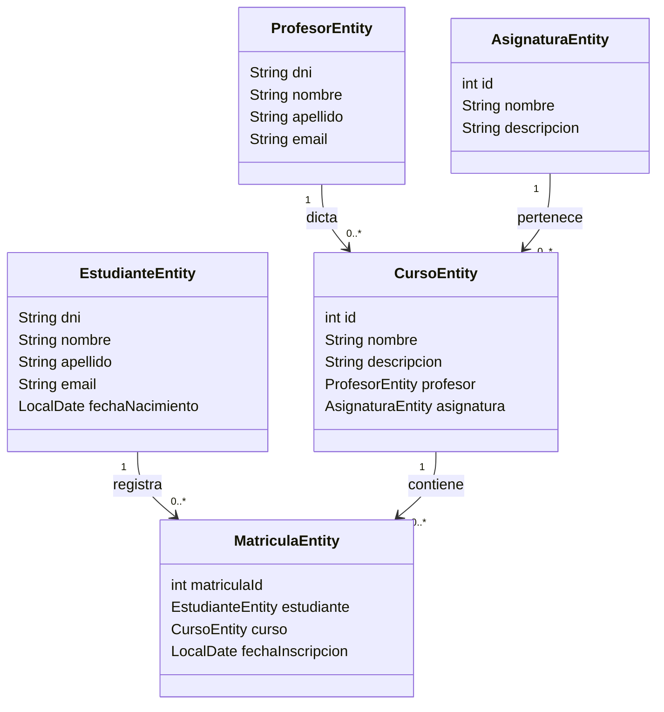

# Diagrama de clases

## Relaciones principales

- Un profesor puede estar asociado a muchos cursos.
- Una asignatura puede estar asociada a muchos cursos.
- Un estudiante puede tener muchas matrículas.
- Un curso puede tener muchas matrículas.
